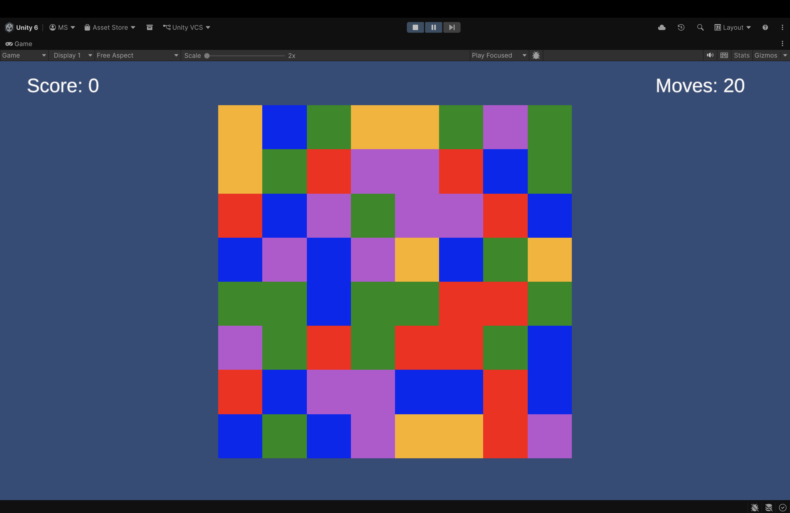
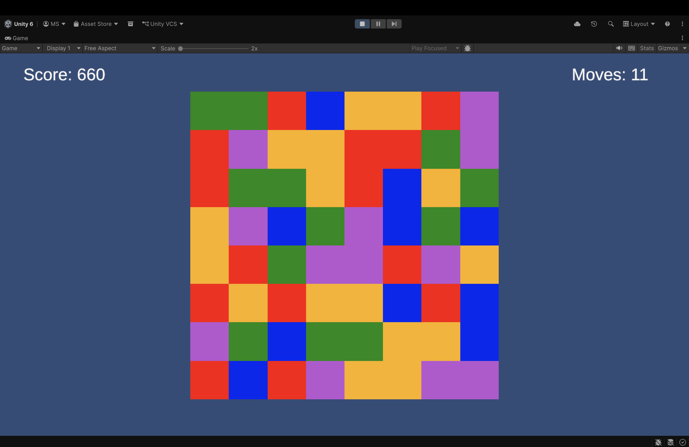
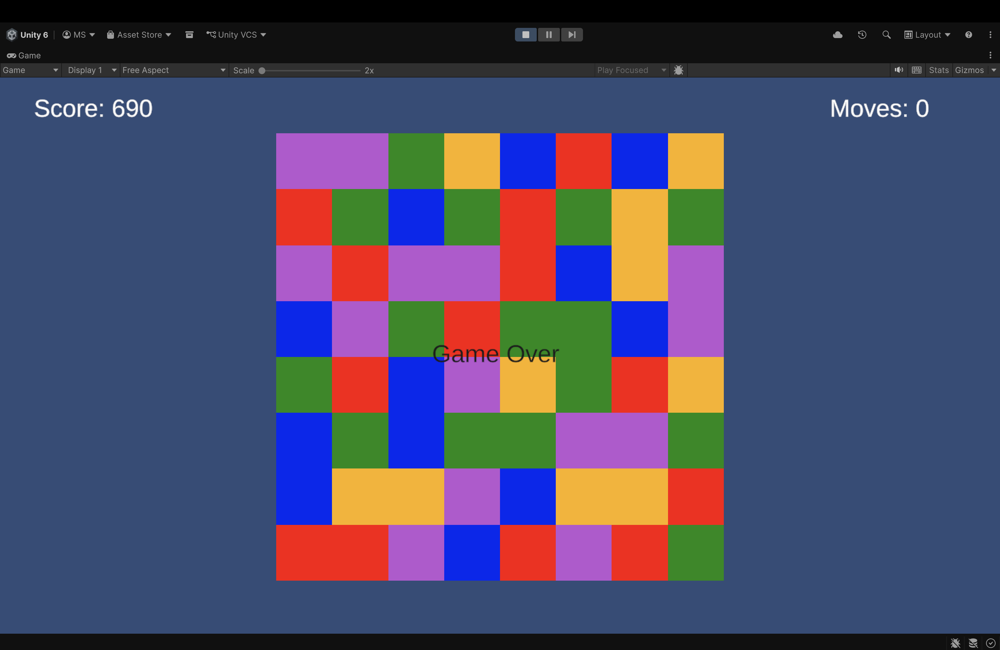

# Match-3 Game (Game 7 – 20 Games Challenge)

## Overview
This is a classic Match-3 puzzle game where players swap adjacent tiles to create matches of three or more identical tiles. When a match is formed, tiles disappear, new tiles fall into place, and the player earns points.

## Features
- Grid-based board system
- Tile swapping using mouse input
- Match detection (horizontal & vertical)
- Matched tiles are removed
- Gravity system (tiles fall down)
- New tiles spawn automatically
- Score system
- Move-limited gameplay
- UI displaying score and moves
- Game Over when moves reach zero

## Engine Used
- Unity (2D)

## How to Play
1. Click on a tile
2. Click on an adjacent tile to swap
3. Match 3 or more tiles of the same type
4. Earn points for each match
5. Game ends when all moves are used

##  What I Learned
- Grid-based game design
- Handling player input using raycasting
- Match detection logic
- Managing game state (score, moves, game over)
- UI integration using TextMeshPro
- Debugging and fixing runtime errors

## Challenges Faced
- Preventing matches at the start of the game
- Fixing infinite loops during tile spawning
- Managing grid updates correctly after swapping
- Handling NullReference errors in Unity
- Connecting UI elements properly

## Screenshots
### Gameplay

### UI (Score & Moves)

